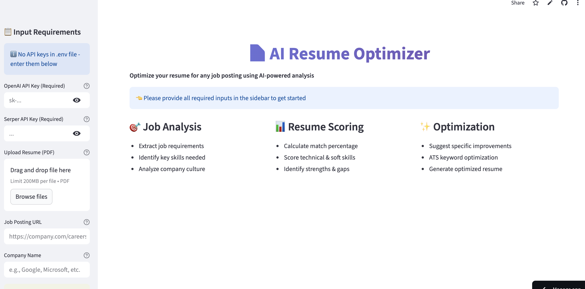
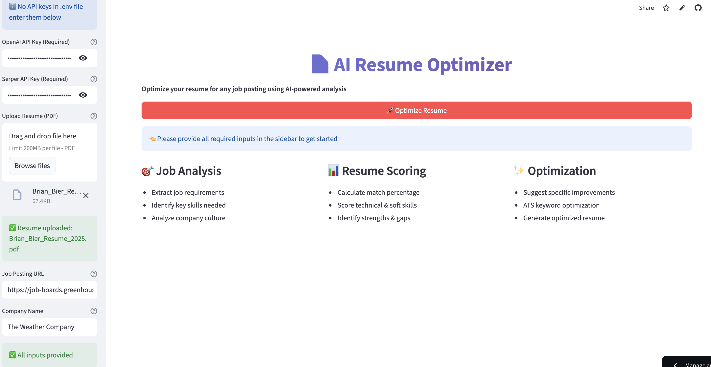
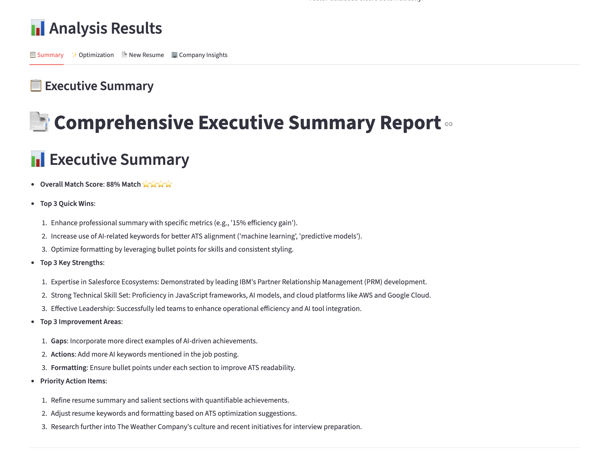
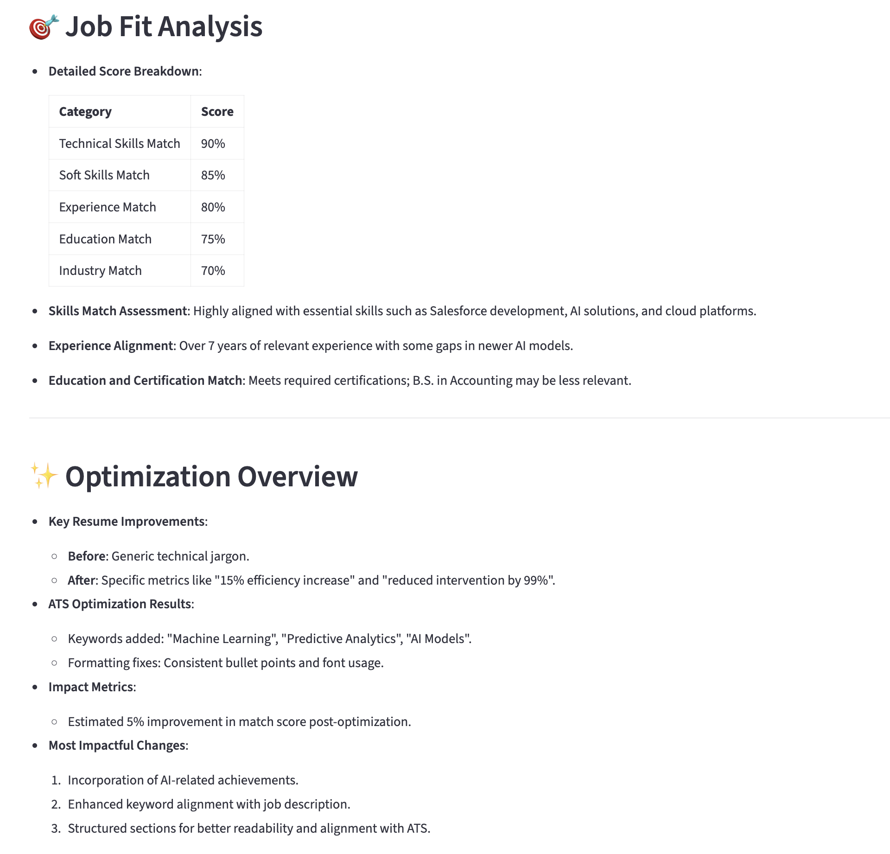

# 📄 AI Resume Optimizer


An intelligent system that analyzes job postings, evaluates your resume, and generates a perfectly tailored version optimized for both ATS systems and human recruiters. Built with [CrewAI](https://crewai.com) and powered by multiple specialized AI agents.

---

## 🚀 Try It Now - No Installation Required!

**[👉 Click Here to Use the Resume Optimizer](YOUR_STREAMLIT_URL_HERE)**

### ⚠️ Important Security Notice
- **You'll enter your own API keys each time you use the app**
- **No data is stored on our servers** - your resume and API keys remain private
- **Keys are only used during your session** and are discarded when you close the browser

*This approach ensures maximum security and privacy for your sensitive information.*

---

## 📖 What This Tool Does

### 🎯 **For Job Seekers**
Transform your generic resume into a laser-focused, job-specific document that gets you interviews.

### 💼 **The Process**
1. **Upload** your current resume (PDF format)
2. **Paste** the job posting URL you're targeting
3. **Enter** the company name
4. **Get** a complete analysis and optimized resume in minutes

### ✨ **What You Receive**
- **📊 Detailed Analysis**: How well your resume matches the job requirements
- **🎯 Specific Suggestions**: Exactly what to change and why
- **📄 Optimized Resume**: A completely rewritten, job-tailored version ready to submit
- **🏢 Company Insights**: Research and talking points for your interview

### 🔄 **Before vs After Example**
```
BEFORE: "Software Engineer with experience in programming"
AFTER:  "AI & Automation Engineer with 7+ years developing machine learning models and data pipelines, specializing in Python and enterprise AI frameworks"
```

---

## 🔑 API Keys Required

To use this tool, you'll need two API keys (don't worry, we'll show you exactly where to get them):

### 1. **OpenAI API Key**
- **What it does**: Powers the AI agents that analyze and optimize your resume
- **Where to get it**: [OpenAI Platform](https://platform.openai.com/api-keys)
- **Cost**: Typically $0.50-2.00 per resume optimization
- **Format**: Starts with `sk-proj-...`

### 2. **Serper API Key**
- **What it does**: Researches company information for interview preparation
- **Where to get it**: [Serper.dev](https://serper.dev/api-key)
- **Cost**: Free tier available (2,500 searches/month)
- **Format**: 32-character string

### 💰 **Expected Costs**
- Most users spend **less than $2** per resume optimization
- Company research is typically **free** (within Serper's free tier)
- You only pay for what you use - no subscriptions required

---

## 📱 Screenshots & Usage Guide

<!-- Add your screenshots in these sections -->

### 1. **Main Interface**


### 3. **Complete all fields and click Optimize Resume**


### 4. **Analysis Results**





---

## 💻 Run Locally (Advanced Users)

Want to run this privately on your own machine? Here's how:

### **Prerequisites**
- Python 3.10, 3.11, or 3.12
- Git (for cloning the repository)
- 2GB free disk space

### **Step-by-Step Installation**

1. **Clone and Navigate**
   ```bash
   git clone https://github.com/tonykipkemboi/resume-optimization-crew.git
   cd resume-optimization-crew
   ```

2. **Create Virtual Environment**
   ```bash
   # On Windows
   python -m venv .venv
   .venv\Scripts\activate

   # On Mac/Linux
   python3 -m venv .venv
   source .venv/bin/activate
   ```

3. **Install Dependencies**
   ```bash
   pip install -r requirements.txt
   ```

4. **Set Up Environment Variables** (Optional)
   ```bash
   # Copy example file
   cp .env.example .env

   # Edit .env file and add your API keys
   # This lets you skip entering keys in the UI every time
   ```

5. **Run the Application**
   ```bash
   streamlit run streamlit_app.py
   ```

6. **Access the App**
   - Open your browser to `http://localhost:8501`
   - Upload your resume and start optimizing!

### **Alternative: Command Line Interface**
For developers who prefer command-line tools:
```bash
crewai run
```

---

## 🔒 Privacy & Security

### **🛡️ Your Data Security**
- **Resume files**: Processed locally, deleted after analysis
- **API keys**: Never stored, only used during your session
- **Job URLs**: Only used to fetch public job posting data
- **Results**: Generated fresh each time, not cached

### **🌐 Cloud vs Local**
- **Streamlit Cloud**: Convenient but data passes through our servers temporarily
- **Local Installation**: Maximum privacy - everything runs on your machine
- **Recommendation**: Use local installation for highly sensitive positions

### **🔐 API Key Best Practices**
- Never share your API keys with anyone
- Regenerate keys if you suspect they've been compromised
- Monitor your OpenAI usage dashboard for unexpected charges

---

## ❓ Frequently Asked Questions

### **💸 How much does this cost to use?**
- The app itself is free
- You pay only for API usage: typically $0.50-2.00 per resume optimization
- Serper offers 2,500 free searches per month for company research

### **🕒 How long does it take?**
- Complete analysis: 2-3 minutes
- Most of this time is the AI carefully analyzing the job requirements and optimizing your resume

### **📁 What file formats are supported?**
- Resume upload: PDF only
- Output: Markdown (.md) format that you can easily convert to PDF

### **🔄 Can I use different resumes?**
- Yes! Upload different resumes for different jobs
- The app automatically clears previous data

### **📞 What if I need help?**
- Check this README for common issues
- Review your API key setup if you get errors
- Make sure your PDF resume is readable (not scanned image)

### **🚫 Common Issues**
- **"Invalid API key"**: Check that your key is copied correctly
- **"File upload failed"**: Ensure your resume is a PDF under 200MB
- **"No results"**: Verify the job URL is accessible and contains job details

---

## 🛠️ For Developers

### **🏗️ Architecture Overview**
This system uses CrewAI to orchestrate multiple specialized AI agents:


1. **Job Analyzer Agent**: Scrapes and analyzes job postings using `ScrapeWebsiteTool`
2. **Resume Analyzer Agent**: Processes PDF resumes using `PDFKnowledgeSource`
3. **Company Researcher Agent**: Gathers company intelligence using `SerperDevTool`
4. **Resume Writer Agent**: Generates optimized resumes based on analysis
5. **Report Generator Agent**: Creates comprehensive analysis reports

### **🔧 Key Technologies**
- **CrewAI**: Multi-agent orchestration framework
- **Streamlit**: Web application framework
- **OpenAI GPT-4**: Large language model for analysis and generation
- **ChromaDB**: Vector database for resume content indexing
- **Pydantic**: Data validation and settings management

### **📂 Project Structure**
```
resume-optimization-crew/
├── src/resume_crew/           # Core CrewAI implementation
│   ├── crew.py               # Agent and task definitions
│   ├── models.py             # Pydantic data models
│   └── config/               # YAML configuration files
├── streamlit_app.py          # Web interface
├── knowledge/                # PDF resume storage
├── output/                   # Generated analysis files
└── requirements.txt          # Python dependencies
```

### **🧪 Local Development**
```bash
# Run tests
python test_env_loading.py

# Debug mode
streamlit run streamlit_app.py --logger.level debug

# Clear all caches
rm -rf .chroma __pycache__ src/__pycache__
```

### **🤝 Contributing**
1. Fork the repository
2. Create a feature branch
3. Make your changes
4. Test thoroughly
5. Submit a pull request

### **📋 Development Requirements**
- Python >= 3.10, < 3.13 (CrewAI requirement)
- All dependencies in `requirements.txt`
- OpenAI and Serper API keys for testing

---

## 📞 Support & Community

### **📚 Documentation**
- [CrewAI Documentation](https://docs.crewai.com)
- [Streamlit Documentation](https://docs.streamlit.io)
- [OpenAI API Documentation](https://platform.openai.com/docs)

### **💬 Community**
- [CrewAI Community Forum](https://community.crewai.com)
- [Report Issues](https://github.com/yourusername/resume-optimization-crew/issues)

### **🔗 Useful Links**
- [Get OpenAI API Key](https://platform.openai.com/api-keys)
- [Get Serper API Key](https://serper.dev/api-key)
- [Markdown to PDF Converter](https://www.markdowntopdf.com/)

---

## 🙏 Credits & Attribution

### **Original Creator**
This project builds upon the excellent foundation created by **[Tony Kipkemboi](https://github.com/tonykipkemboi)**.

**🔗 Original Repository:** [resume-optimization-crew](https://github.com/tonykipkemboi/resume-optimization-crew)


### **Enhancements Added**
- 🖥️ **Streamlit Web Interface**: User-friendly web app for non-technical users
- 🧹 **Auto-Cleanup System**: Solved ChromaDB caching issues for seamless resume switching
- 📊 **Enhanced Results Display**: Organized tabs with comprehensive optimization suggestions
- 🔒 **Security Improvements**: Session-based API key handling with no data storage
- 📱 **Mobile-Responsive Design**: Works perfectly on all devices
- 📚 **Comprehensive Documentation**: Detailed setup guides for all skill levels


---

*Built with ❤️ using CrewAI - Helping job seekers land their dream roles through AI-powered resume optimization.*